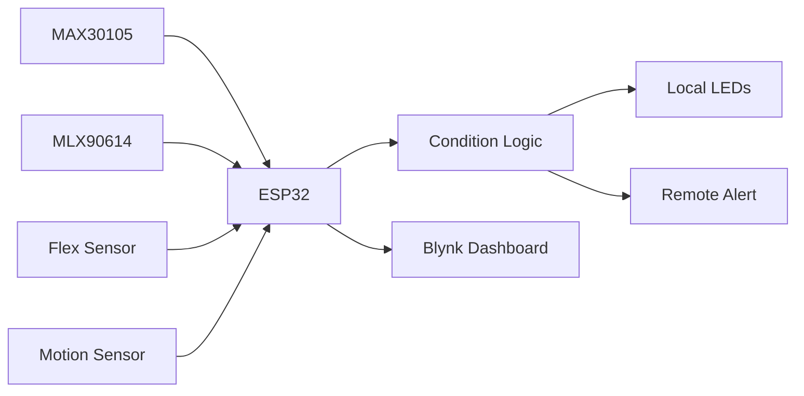

# IoT Patient Vital Monitoring System

<p align="center">
  <strong>ESP32-based multi-sensor health monitoring with remote alerts</strong>
</p>

<p align="center">
  
  
  
</p>

## Project at a Glance

| Item | Details |
|---|---|
| Domain | Biomedical IoT |
| Controller | ESP32 |
| Sensors | MAX30105, MLX90614, motion sensor, flex sensor |
| Monitoring | Heart-rate-oriented signal, SpO2-oriented value, temperature, respiration proxy, motion |
| Alerts | LEDs + Blynk events |
| Status | Academic engineering prototype |

## Overview

This project explores remote patient monitoring using multiple embedded sensors. Measurements are processed locally on the ESP32, mapped to status indicators, and sent to Blynk for remote viewing and abnormal-condition alerts.

## System Architecture



## Repository Structure

```text
iot-vitals/
├── code/PATIENT.ino
├── PATIENTBLOCK.drawio
├── PATIENT_MONITORING.drawio
└── patient.fzz
```

## Run

Open `code/PATIENT.ino` in Arduino IDE, install the required libraries, configure local Wi-Fi/Blynk credentials, and upload to the ESP32.

## Important Limitation

This is an academic prototype, **not a certified medical device**. Sensor algorithms, thresholds, and derived values require proper calibration and clinical validation before any healthcare use.

## Future Work

- Replace simulated/heuristic derived values with validated algorithms
- Add secure data storage
- Add battery monitoring
- Add caregiver workflows
- Add sensor calibration procedures
- Add fault detection and self-test

## Author

**Sadik Shaik**

Computer Engineering · Biomedical IoT · Embedded Systems
